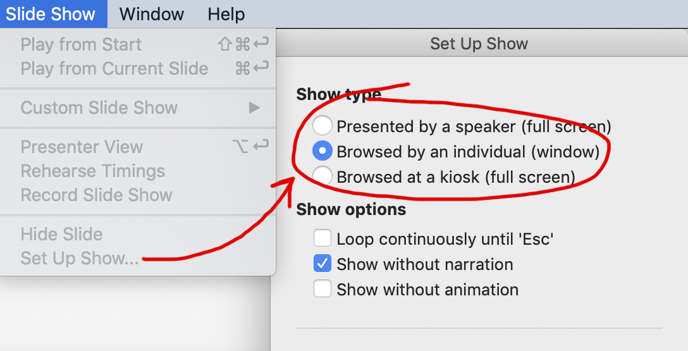

# Presentation

## Basic code

The following is a basic example of the PHPPresentation library. More examples are provided in the [samples folder](https://github.com/PHPOffice/PHPPresentation/tree/master/samples/).

``` php
<?php

$presentation = new PhpPresentation();

// Create slide
$currentSlide = $presentation->getActiveSlide();

// Create a shape (drawing)
$shape = $currentSlide->createDrawingShape();
$shape->setName('PHPPresentation logo')
        ->setDescription('PHPPresentation logo')
        ->setPath('./resources/phppresentation_logo.gif')
        ->setHeight(36)
        ->setOffsetX(10)
        ->setOffsetY(10);
$shape->getShadow()->setVisible(true)
                    ->setDirection(45)
                    ->setDistance(10);

// Create a shape (text)
$shape = $currentSlide->createRichTextShape()
        ->setHeight(300)
        ->setWidth(600)
        ->setOffsetX(170)
        ->setOffsetY(180);
$shape->getActiveParagraph()->getAlignment()->setHorizontal(Alignment::HORIZONTAL_CENTER);
$textRun = $shape->createTextRun('Thank you for using PHPPresentation!');
$textRun->getFont()->setBold(true)
                    ->setSize(60)
                    ->setColor(new Color('FFE06B20'));

$writerPPTX = IOFactory::createWriter($presentation, 'PowerPoint2007');
$writerPPTX->save(__DIR__ . '/sample.pptx');
$writerODP = IOFactory::createWriter($presentation, 'ODPresentation');
$writerODP->save(__DIR__ . '/sample.odp');

```

## Document information

You can set the document information such as title, creator, and company name. Use the following functions:

``` php
<?php

$properties = $presentation->getProperties();

$properties->setCreator('My name');
$properties->setCompany('My factory');
$properties->setTitle('My title');
$properties->setDescription('My description');
$properties->setCategory('My category');
$properties->setLastModifiedBy('My name');
$properties->setCreated(mktime(0, 0, 0, 3, 12, 2014));
$properties->setModified(mktime(0, 0, 0, 3, 14, 2014));
$properties->setSubject('My subject');
$properties->setKeywords('my, key, word');
```

### Custom Properties

You can add custom properties with the method `setCustomProperty`.

Multiple types are available:
* `DocumentProperties::PROPERTY_TYPE_STRING` for string value,
* `DocumentProperties::PROPERTY_TYPE_BOOLEAN` for boolean value,
* `DocumentProperties::PROPERTY_TYPE_FLOAT` for float value,
* `DocumentProperties::PROPERTY_TYPE_INTEGER` for integer value,
* `DocumentProperties::PROPERTY_TYPE_DATE` for date value,
* `DocumentProperties::PROPERTY_TYPE_UNKNOWN` for unknown type value.


``` php
<?php

use PhpOffice\PhpPresentation\DocumentProperties;

$properties = $presentation->getProperties();

// Set the custom property
$properties->setCustomProperty('propertyName', 'propertyValue', DocumentProperties::PROPERTY_TYPE_STRING);

// Check if a custom property exists
$properties->isCustomPropertySet('unknown'); // return `false`
$properties->isCustomPropertySet('propertyName'); // return `true`

// Return all custom properties
$properties->getCustomProperties(); // return `['propertyName']`

// Return value from a custom property
$properties->getCustomPropertyValue('unknown'); // return `null` if not set
$properties->getCustomPropertyValue('propertyName'); // return `propertyValue`

// Return type from a custom property
$properties->getCustomPropertyType('unknown'); // return `null` if not set
$properties->getCustomPropertyType('propertyName'); // return `DocumentProperties::PROPERTY_TYPE_STRING`
```

## Presentation Properties

You can define some properties which are relative to the presentation, like the zoom or the thumbnail.

### Comments

You can define if the presentation display or not the comments with the method `setCommentVisible`.

``` php
<?php

$presentation = new PhpPresentation();
$properties = $presentation->getPresentationProperties();
// Get the display for comment
var_export($properties->isCommentVisible());
// Output : false
// Enable the display for comment
$properties->setCommentVisible(true);
// Get the display for comment
var_export($properties->isCommentVisible());
// Output : true
```

### Last View

You can define the last view of the presentation with the method `setLastView`.

``` php
<?php

$presentation = new PhpPresentation();

$properties = $presentation->getPresentationProperties();
// Get the last view of the presentation
echo $properties->getZoom();
// Output : PresentationProperties::VIEW_SLIDE
// Set the last view of the presentation
$properties->setLastView(PresentationProperties::VIEW_NOTES);
// Get the last view of the presentation
echo $properties->getZoom();
// Output : PresentationProperties::VIEW_NOTES
```

### Mark as final

You must define your presentation as final with the method `markAsFinal()`

``` php
<?php

// Default
$state = $presentation->isMarkedAsFinal();
// $state = false

// Without parameter
$presentation->markAsFinal();
$state = $presentation->isMarkedAsFinal();
// $state = true

// Parameter = false
$presentation->markAsFinal(false);
$state = $presentation->isMarkedAsFinal();
// $state = false

// Parameter = true
$presentation->markAsFinal(true);
$state = $presentation->isMarkedAsFinal();
// $state = true
```

### Slideshow type

You can define the type of slideshow you can with the method `setSlideshowType`.



Differents types are available:

* `PresentationProperties::SLIDESHOW_TYPE_PRESENT` for **Presented by a speaker**
* `PresentationProperties::SLIDESHOW_TYPE_BROWSE` for **Browsed by an individual**
* `PresentationProperties::SLIDESHOW_TYPE_KIOSK` for **Browsed at a kiosk**

``` php
<?php

use PhpOffice\PhpPresentation\PresentationProperties;

$presentation = new PhpPresentation();

$properties = $presentation->getPresentationProperties();
// Set type of slideshow
$properties->setSlideshowType(PresentationProperties::SLIDESHOW_TYPE_PRESENT);
// Get type of slideshow
echo $properties->getSlideshowType();
```

### Thumbnail

You can define the thumbnail of the presentation with the method `setThumbnailPath`.

``` php
<?php

$presentation = new PhpPresentation();

$properties = $presentation->getPresentationProperties();
// Set path of the thumbnail
$properties->setThumbnailPath(__DIR__.'\resources\phppowerpoint_logo.gif');
// Get path of the thumbnail
echo $properties->getThumbnailPath();
```

### Zoom

You can define the zoom of the presentation with the method `setZoom`.

``` php
<?php

$presentation = new PhpPresentation();

$properties = $presentation->getPresentationProperties();
// Get zoom of the presentation
echo $properties->getZoom();
// Output : 1
// Set zoom of the presentation (3 = 300%)
$properties->setZoom(3);
// Get zoom of the presentation
echo $properties->getZoom();
// Output : 3
```
